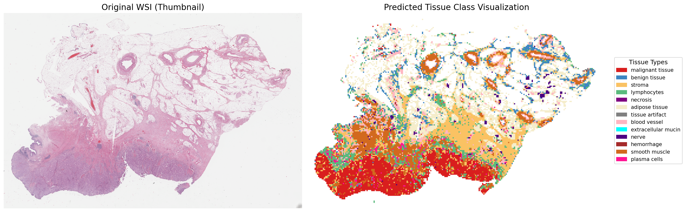

# HistoSelect
* This repository contains the official implementation for our work **"Act Like a Pathologist: Tissue-Aware Whole Slide Image Reasoning"**, accepted by **CVPR 2026**.


### Recent Updates
* **2026/04/08**: Updated the tissue segmentation code and shared the tissue segmentation results.
* 2026/04/01: Added feature extraction scripts and updated documentation.
* 2026/03/30: The preprocessing code for tiling WSI into patches.
* We are currently organizing the codebase. Stay tuned for further updates!

### Part1: Data Preparation
#### Step 1: Cut whole slide image into patches
```bash
python deepzoom_tiler.py \
    --slide_path /path/to/your/wsi_folder \
    --output_base /path/to/output_directory \
    -m 1 -b 40 -s 224 -j 32 -t 15 -o 40 -c True
```

#### Step 2: Extract the patch features
```bash
python extract_features_fp.py \
    --patch_dir /path/to/output_directory/Patch \
    --feat_dir /path/to/feature_directory \
    --model_name conch_v1
```
> Before running the extraction, please ensure you have updated the model weight paths to your local directory in ```./data_preprocessing/models/build.py```.

### Part 2: Tissue Segmentation
This step performs zero-shot tissue classification using a Vision-Language Model (e.g., CONCH) to generate a spatial segmentation map and weak labels for each patch.

#### Input Requirements
The segmentation script requires the outputs generated in **Part 1**:
1.  **Patches**: `.png` tiles generated from **Step 1** (e.g., `Output/Patch/Slide_ID/`).
2.  **Features (H5)**: Coordinate metadata files generated from **Step 2** (e.g., `Feature/h5_files/Slide_ID.h5`).
3.  **WSI**: The original `.svs` slide for thumbnail visualization.

#### Execution
Run the following script to process a slide. This will generate a prediction CSV, a tissue-label H5 file, and a visualization map.

```bash
python tissue_segmentation.py
```
Note: Before execution, please ensure you have updated the model weight paths and input/output directories to your local paths within `tissue_segmentation.py`.

The script produces a side-by-side reconstruction of the original WSI and the predicted tissue semantic map. An example is shown below:


We also provide pre-computed tissue segmentation results for the TCGA cohort from the [SlideChat](https://github.com/uni-medical/SlideChat) and [WSI-LLava](https://github.com/XinhengLyu/WSI-LLaVA) datasets.
