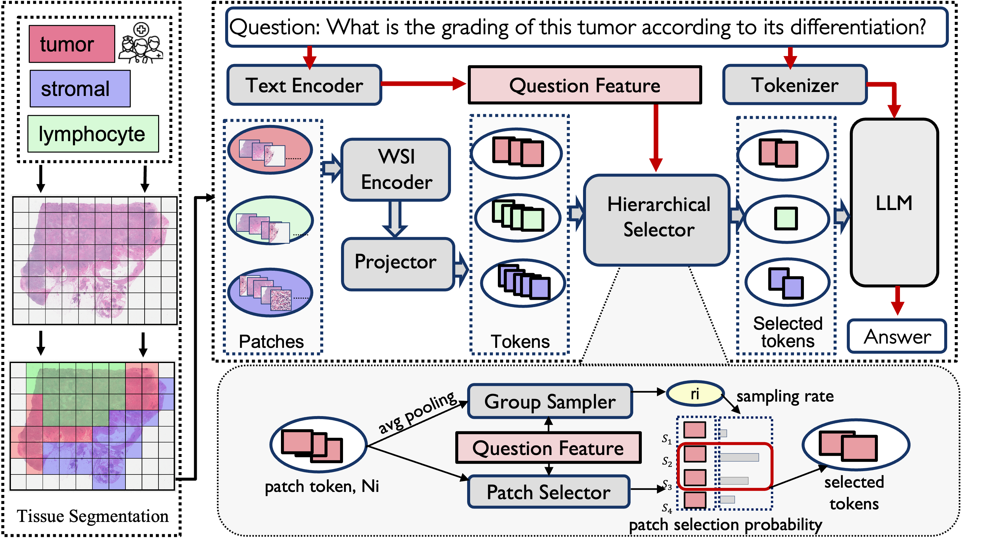
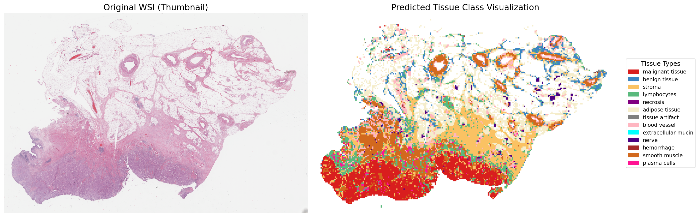

<div align="center">
<h1> [CVPR 2026] Act Like a Pathologist: Tissue-Aware Whole Slide Image Reasoning </h1>

[Wentao Huang](https://winston52.github.io/)<sup>1</sup>, [Weimin Lyu](https://weimin17.github.io/)<sup>1</sup>, [Peiliang Lou](https://scholar.google.com/citations?user=4qSntjYAAAAJ&hl=zh-CN)<sup>2</sup>, [Qingqiao Hu](https://winstonhutiger.github.io/)<sup>1</sup>, [Xiaoling Hu](https://huxiaoling.github.io/)<sup>3</sup>, [Shahira Abousamra](https://shahiraabousamra.github.io/)<sup>4</sup>, [Wenchao Han](https://www.mayo.edu/research/faculty/han-wenchao-pd-d/bio-20576975)<sup>2</sup>, [Ruifeng Guo](https://www.mayo.edu/research/faculty/guo-ray-m-d-ph-d/bio-20491543)<sup>2</sup>, [Jiawei Zhou](https://joezhouai.com/)<sup>1</sup>, [Chao Chen](https://chaochen.github.io/)<sup>1</sup>, [Chen Wang](https://www.mayo.edu/research/faculty/wang-chen-ph-d/bio-20140227)<sup>2</sup>

<sup>1</sup> Stony Brook University &nbsp;&nbsp; <sup>2</sup> Mayo Clinic &nbsp;&nbsp; <sup>3</sup> Harvard Medical School &nbsp;&nbsp; <sup>4</sup> Stanford University

[](https://github.com/winston52/HistoSelect)
[](https://arxiv.org/abs/2603.00667)
[](https://opensource.org/licenses/MIT)
</div>


## Introduction

We propose **HistoSelect**, a tissue-aware hierarchical patch selector for whole slide image (WSI) reasoning. Inspired by how pathologists first locate relevant tissue regions and then attend to discriminative patches inside them, HistoSelect plugs a `GroupSelector → PatchSelector` head into a LLaVA-style multimodal LLM, trained with a variational information-bottleneck objective.

<div align="center">

</div>


## 🔥 Recent Updates

* **`2026/06/02`**: Updated the tissue segmentation files, training and testing code.
* `2026/04/08`: Updated the tissue segmentation code.
* `2026/04/01`: Added feature extraction scripts and updated documentation.
* `2026/03/30`: The preprocessing code for tiling WSI into patches.
* We are currently organizing the codebase. Stay tuned for further updates!


## 🛠️ Install

Clone this repository and set up the conda environment:

```bash
git clone https://github.com/winston52/HistoSelect.git
cd HistoSelect

conda env create -f environment.yaml
conda activate histoselect
pip install -e .
```


## Step-by-step Tutorial

### 1. Prepare Data

#### 1.1 Cut whole slide images into patches

```bash
python data_preprocessing/deepzoom_tiler.py \
    --slide_path /path/to/your/wsi_folder \
    --output_base /path/to/output_directory \
    -m 1 -b 40 -s 224 -j 32 -t 15 -o 40 -c True
```

#### 1.2 Extract patch features

```bash
python data_preprocessing/extract_features_fp.py \
    --patch_dir /path/to/output_directory/Patch \
    --feat_dir /path/to/feature_directory \
    --model_name conch_v1
```

> Before running, place the CONCH model checkpoint at `./data/models/conch_v1.pt` (or edit the path inside `data_preprocessing/models/builder.py`).

#### 1.3 Tissue segmentation

Generate a tissue-class map and per-patch weak labels using a Vision-Language Model (e.g., CONCH):

```bash
python data_preprocessing/tissue_segmentation.py
```

The script produces a side-by-side reconstruction of the original WSI and the predicted tissue semantic map:

<div align="center">

</div>

Pre-computed tissue segmentation results for the TCGA cohort (covering both the [SlideChat](https://github.com/uni-medical/SlideChat) and [WSI-LLaVA](https://github.com/XinhengLyu/WSI-LLaVA) datasets) are available via Google Drive:

> 📥 [**Download tissue segmentation (Google Drive)**](https://drive.google.com/file/d/1YEUn7MR-7J-xuNwk6MnjihEVjidpIbqN/view?usp=sharing)

#### 1.4 Pre-compute question embeddings

```bash
python data_preprocessing/generate_question_embeddings.py \
    --json /path/to/your_vqa.json \
    --out  /path/to/output_question_embeddings.pt
```


### 2. Training and Evaluation

Both training and evaluation require a stage-2 warmstart checkpoint. Download it from [SlideChat on HuggingFace](https://huggingface.co/General-Medical-AI/SlideChat_Weight/tree/main/stage2_pth) and place it at `./data/models/stage2.pth`.

HistoSelect fine-tuned checkpoints are available via Google Drive:

> 📥 [**Download HistoSelect weights (Google Drive)**](https://drive.google.com/drive/folders/1x9Pyh--tb7vowRRPh6N6sUQRQruleTx9?usp=sharing)
>
> - `histoselect_wsi-llava.pth` — HistoSelect trained on WSI-LLaVA
> - `histoselect_slidechat.pth` — HistoSelect trained on SlideBench-VQA-TCGA

#### 2.1 Training

```bash
bash scripts/histoselect_training.sh
```

This launches 4-GPU training with `xtuner/configs/histoselect/stage_2_selector.py`. Switch between WSI-LLaVA and SlideChat datasets by editing the `DATASET` variable at the top of the config. Checkpoints are saved to `work_dirs/histoselect_run/iter_*.pth/`.


#### 2.2 Evaluation

Run `scripts/histoselect_testing.sh` with the trained checkpoint and the appropriate test data:

**WSI-LLaVA**

```bash
CKPT=<path-to-your-checkpoint.pth> \
TEST_JSON=./data/instruct/stage_2_vqa_selector_wsi-llava/test_merge_cleaned.json \
QEMB=./data/embeddings/wsi-llava_test_question_embeddings.pt \
bash scripts/histoselect_testing.sh
```

**SlideChat (SlideBench-VQA-TCGA)**

```bash
CKPT=<path-to-your-checkpoint.pth> \
TEST_JSON=./data/instruct/stage_2_vqa_selector_slidechat/SlideBench-VQA-TCGA.json \
QEMB=./data/embeddings/SlideBench-VQA-TCGA_question_embeddings.pt \
bash scripts/histoselect_testing.sh
```

Predictions are saved to `./outputs/eval/predictions.json`.


## 🤝 Acknowledgments

- [SlideChat](https://github.com/uni-medical/SlideChat) — the WSI VQA pipeline our framework is built on.
- [WSI-LLaVA](https://github.com/XinhengLyu/WSI-LLaVA) — provide WSI-Bench dataset.
- [DSMIL](https://github.com/binli123/dsmil-wsi) & [CLAM](https://github.com/mahmoodlab/CLAM) — data preprocessing (WSI tiling and patch feature extraction).
- [CONCH](https://github.com/mahmoodlab/CONCH) — the vision-language model used for tissue segmentation and question-embedding generation.


## ✏️ Reference

If you find HistoSelect useful in your research or applications, please consider giving a star ⭐ and citing using the following BibTeX:

```bibtex
@inproceedings{huang2026act,
  title={Act Like a Pathologist: Tissue-Aware Whole Slide Image Reasoning},
  author={Huang, Wentao and Lyu, Weimin and Lou, Peiliang and Hu, Qingqiao and Hu, Xiaoling and Abousamra, Shahira and Han, Wenchao and Guo, Ruifeng and Zhou, Jiawei and Chen, Chao and Wang, Chen},
  booktitle={CVPR},
  year={2026}
}
```
